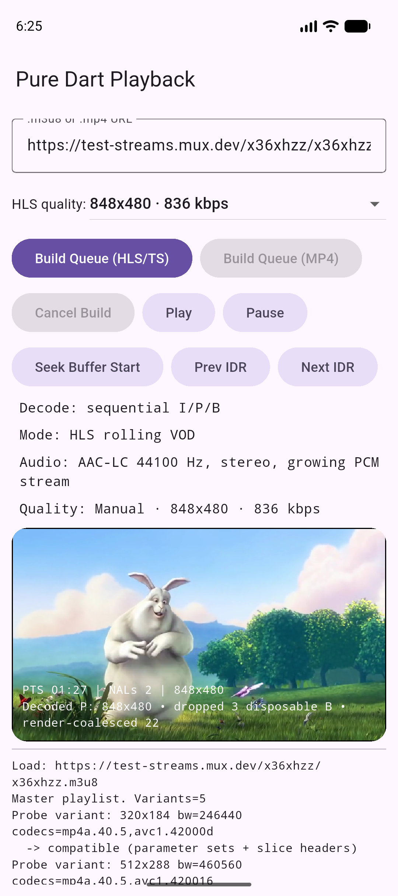

# NDVY Player — Dart-native H.264 + AAC Playback

NDVY Player is an experimental Flutter media player that demuxes and decodes
H.264 video and AAC-LC audio without `video_player`, FFmpeg, MediaCodec,
AVPlayer, or another platform video codec. Compressed media stays in Dart.
Decoded PCM crosses a small `dart:ffi` boundary to AAudio or AudioQueue, and
Flutter displays the decoded video frames.

**Current status:** the documented implementation is complete as of
2026-08-21. Its validation evidence and known performance boundary are
described in
[WHITEPAPER.md](WHITEPAPER.md).

## Current video quality

<p align="center">
  
</p>

The screenshot is an actual Android emulator profile run of the public Mux
master playlist at **848x480 / 836 kbps**. The on-frame diagnostics show the
decoded resolution, disposable B-frame drops, and coalesced render work.

The tested master is:

```text
https://test-streams.mux.dev/x36xhzz/x36xhzz.m3u8
```

It advertises these verified quality choices:

| Selection | Advertised bandwidth | First complete TS segment regression |
| --- | ---: | --- |
| 320x184 | 246 kbps | 300/300 pictures pixel-exact |
| 512x288 | 461 kbps | 300/300 pictures pixel-exact |
| 848x480 | 836 kbps | 600/600 pictures pixel-exact |
| 1280x720 | 2149 kbps | 600/600 pictures pixel-exact |
| 1920x1080 | 6222 kbps | 600/600 pictures pixel-exact |

“Pixel-exact” means the cropped planar I420 output matched an independent
FFmpeg/VideoToolbox reference for every picture in the regression segment. It
proves decode correctness, not real-time speed on every phone.

## What the current implementation includes

- Rolling finite-VOD and bounded live HLS media-playlist refresh.
- MPEG-TS PAT/PMT/PES, Annex-B H.264, ADTS AAC, continuity, PTS unwrap, and
  shared discontinuity epochs.
- Progressive 8-bit YUV 4:2:0 H.264 for the bounded Baseline/Main/High syntax
  exercised by the verified streams.
- CAVLC and CABAC I, P, and B pictures, including spatial and temporal Direct,
  intra 4x4/8x8/16x16, transform 4x4/8x8, supported inter partitions,
  weighted prediction, short-term DPB/list reordering, POC, MMCO 1, and
  in-loop deblocking.
- Pure-Dart AAC-LC decode with an audio-master playback clock.
- A persistent H.264 worker isolate and background YUV-to-RGBA conversion.
- One in-flight image upload with latest-frame coalescing and viewport-sized
  output to reduce UI-isolate work and allocation pressure.
- Conservative dropping of sufficiently late disposable non-reference B
  pictures. Reference pictures, IDRs, P pictures, SPS, and PPS are never
  skipped by this policy.
- Manual quality selection and basic automatic quality switching.
- Seamless rendition changes: a selection is staged for a safe upcoming
  segment/IDR boundary instead of stopping and rebuilding current playback.
- Compatibility probing that rejects unsupported parameter-set or slice
  syntax before a rendition is admitted.
- Bounded segment queues, compressed-video retention, decoded PCM storage, and
  presentation reordering.

Unsupported or malformed syntax fails closed rather than being guessed.

## Quality behavior

**Manual** keeps the requested compatible rendition and applies the change at
the next safe boundary. The UI can briefly show `active → pending` while the
already-buffered segment finishes; audio and playback state continue.

**Auto** uses measured network throughput and decoder/render lateness. It can
step up when healthy and repeatedly step down while the device remains behind.
On the tested Pixel-class phone, Auto normally settles below 720p for this
60-fps source.

720p and 1080p are decode-correct but remain best-effort in the current
pure-Dart software path. They can stutter on phones. A physical-device 720p
measurement decoded the retained reference cadence at 22.21 fps and took
14.319 seconds for 10 seconds of source after conservative disposable-B
skipping; real-time playback required roughly 31.8 retained pictures/s.
The current software path therefore does not claim smooth mobile 720p60 or
1080p60.

## Run

This repository uses FVM. Run Flutter commands through `fvm flutter`.

```sh
fvm flutter pub get
fvm flutter run
```

In the app:

1. Leave the default Mux `.m3u8` URL or enter another compatible HLS/MP4 URL.
2. Choose **Auto** or a manual HLS quality.
3. Select **Build Queue (HLS/TS)**.
4. When the two-segment readiness gate opens, select **Play**.
5. A later quality change is staged and joined at a safe boundary without
   restarting playback.

Android audio uses AAudio and requires Android 8.0 / API 26 or newer.

## Playback architecture

```text
HLS/MP4 input
     |
     +--> bounded playlist/segment loader
     +--> MPEG-TS or MP4 demux
                   |
          timestamped access units
             /             \
            v               v
   H.264 worker isolate   AAC-LC worker
      YUV 4:2:0 frames    file-backed PCM
            |               |
    render worker +       AAudio / AudioQueue
    latest-frame slot       master clock
            \               /
             +-- PTS scheduler --+
                       |
                  Flutter view
```

Important implementation locations:

- `lib/player_page.dart` — playback session, compatibility probe, quality
  selection, and UI integration.
- `lib/src/hls_quality.dart` — manual/automatic rendition policy.
- `lib/src/hls_vod_session.dart` and `lib/src/hls_live_session.dart` — rolling
  HLS coordination.
- `lib/src/ts_h264_demux.dart` — stateful H.264 transport demux.
- `lib/src/decoder/h264_baseline_idr_decoder.dart` — H.264 picture decode.
- `lib/src/decoder/h264_decode_worker.dart` — persistent video worker isolate.
- `lib/src/audio/` — AAC-LC decode, file-backed PCM, clock, and native sinks.
- `lib/src/render/` and `lib/pure_frame_view.dart` — background conversion,
  upload coalescing, and frame display.
- `lib/src/player_clock.dart` — audio-master sequential decode/presentation
  scheduling.

## Validation

The current completion snapshot passed:

```sh
fvm flutter analyze
fvm flutter test
```

Result: **618 tests passed and 2 intentional opt-in platform tests skipped**.

The full network rendition regression is opt-in because it downloads and
decodes large public test segments:

```sh
fvm flutter test \
  --dart-define=MUX_FULL_RENDITION_REGRESSION=true \
  test/decoder/mux_x36xhzz_all_renditions_network_test.dart
```

That command passed all five Mux renditions at the current snapshot. Focused
tests additionally cover malformed input, CABAC/CAVLC syntax, POC/DPB/MMCO,
weighted prediction, Direct motion, transforms, deblocking, TS continuity,
quality selection, queue boundaries, audio timing, worker lifecycle, frame
coalescing, and rollback after failed candidate pictures.

## Known limitations

- This remains a bounded experimental codec implementation, not a general
  replacement for all H.264, AAC, MP4, or HLS content.
- Smooth 720p60/1080p60 mobile playback is outside the current
  performance envelope. Auto quality is the recommended phone mode.
- HLS currently targets MPEG-TS H.264 plus ADTS AAC. fMP4/CMAF, encryption,
  DRM, and general `EXT-X-MEDIA` alternate-audio handling are unsupported.
- Only progressive 8-bit 4:2:0 H.264 within the validated tool envelope is
  accepted. Interlaced, high-bit-depth, and other chroma formats are rejected.
- RGBA rendering currently uses limited-range BT.601; VUI color metadata is
  not yet propagated to the renderer.
- Rolling seek is limited to the common retained audio/video window.
- Audio output is implemented for Android API 26+, iOS, and macOS.

## Current scope boundary

The current scope ends with correct multi-rendition software decode, seamless
manual and basic automatic quality switching, bounded playback state, and
UI/render coalescing. Future work may add a native hardware-video backend for
smooth 720p60/1080p60 on phones while keeping the pure-Dart path as the
reference and fallback implementation. That work is not part of the current
completion claim.
